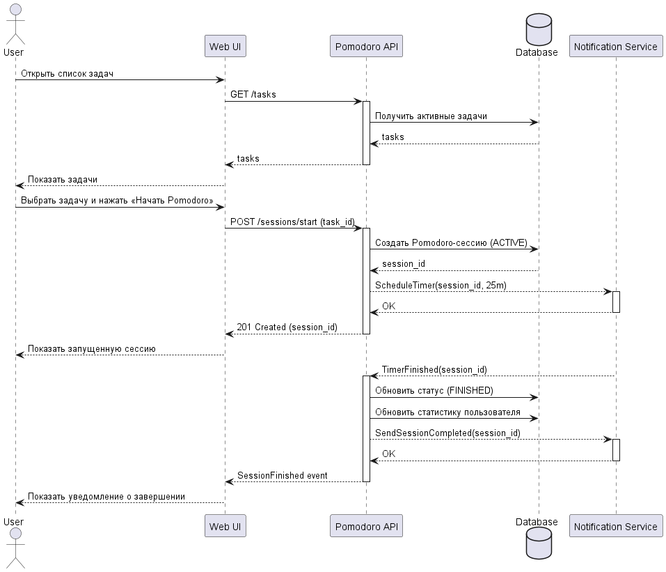
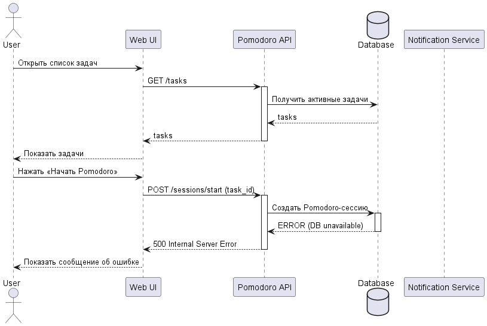

<p align="center">Министерство образования Республики Беларусь</p>
<p align="center">Учреждение образования</p>
<p align="center">"Брестский Государственный технический университет"</p>
<p align="center">Кафедра ИИТ</p>
<br><br><br><br><br><br>
<p align="center"><strong>Лабораторная работа №1</strong></p>
<p align="center"><strong>По дисциплине:</strong> "Проектирование интернет-систем"</p>
<p align="center"><strong>Тема:</strong> "Сценарий транзакции: моделирование use-case и границ ответственности"</p>
<br><br><br><br><br><br>
<p align="right"><strong>Выполнил:</strong></p>
<p align="right">Студент 3 курса</p>
<p align="right">Группы ПО-13</p>
<p align="right">Литвинчук А.М.</p>
<p align="right"><strong>Проверил:</strong></p>
<p align="right">Несюк А.Н.</p>
<br><br><br><br><br>
<p align="center"><strong>Брест 2026</strong></p>

---

## Цель работы

Научиться анализировать бизнес-процессы интернет-системы, выявлять границы ответственности компонентов и моделировать транзакционные сценарии с учётом возможных сбоев.

---

## Вариант №27 - Помидор «Томатная продуктивность» 

**Питч:** Питч: Время – деньги, перерыв – святое.

**Ядро домена:** Ядро домена: Задачи, Сессии, Статистика, Уведомления

---

## Ход выполнения работы

### 1. Структура проекта

```
lab-01/
├── README.md               # Основной отчёт (этот документ)
├── use-case.md             # Текстовое описание use-case
├── diagrams/
│   ├── sequence-happy.puml # PlantUML для успешного сценария
│   ├── sequence-happy.png  # Экспорт диаграммы
│   ├── sequence-error-payment.puml
│   └── sequence-error-payment.png
├── scenarios.feature       # Gherkin-сценарии
└── analysis.md             # Анализ границ ответственности
```

---

### 2. Use-case описание

👉 **Ссылка на файл:** [use-case.md](use-case.md)

**Основной сценарий:** Запуск Pomodoro‑сессии

**Первичный актор:** Пользователь

**Цель:** Начать Pomodoro‑сессию для выбранной задачи и получить уведомление о её завершении.

**Краткое описание основного потока:**
1.Пользователь авторизован в системе.
2.В системе существует хотя бы одна активная задача.
3.Нет другой активной Pomodoro‑сессии.

**Альтернативные потоки:** 
1. Если пользователь выбрал завершённую задачу:
2. Система отображает сообщение об ошибке.
3. Возврат к шагу 2.
4. Если пользователь завершает сессию вручную:
5. Пользователь нажимает «Завершить».
6. Система фиксирует фактическую длительность.
7. Возврат к шагу 7.
8. Если пользователь ставит сессию на паузу:
9. Пользователь нажимает «Пауза».
10. Система фиксирует время паузы.
11. Пользователь нажимает «Продолжить».
12. Система возобновляет таймер.
13. Возврат к шагу 5.

**Исключительные ситуации:**
- 3b. Если произошла ошибка при создании сессии:
  - 3b1. Система откатывает транзакцию.
  - 3b2. Система уведомляет пользователя.
  - 3b3. Use-case завершается неудачей.

- 5a. Если таймер не может быть запущен:
  - 5a1. Система помечает сессию как Failed.
  - 5a2. Система уведомляет пользователя.
  - 5a3. Use-case завершается неудачей.

---

### 3. Диаграммы последовательности (Sequence Diagrams)

#### 3.1. Happy Path (успешный сценарий)

👉 **PlantUML исходник:** [sequence-happy.puml](diagrams/sequence-happy.puml)



## Успешного сценария

**Описание потока:**
- Пользователь открывает список задач и выбирает нужную.
- Нажимает кнопку «Начать Pomodoro».
- Система проверяет, что задача активна и нет другой запущенной сессии.
- Создаёт новую Pomodoro‑сессию в базе данных.
- Запускает таймер через Notification Service.
- Возвращает пользователю подтверждение о старте сессии.
- Пользователь видит активную Pomodoro‑сессию и начинает работу.


**Участники:**
- Пользователь (Actor): инициирует запуск Pomodoro‑сессии
- Web UI: интерфейс, через который пользователь выполняет действие
- Pomodoro API: основной сервис, обрабатывающий бизнес‑логику
- Database (DB): хранилище задач и Pomodoro‑сессий
- Notification Service: внешний сервис для запуска таймера и отправки уведомлений
- Logging Service: внешний сервис для записи событий и ошибок


#### 3.2. Error Case (сценарий с ошибкой)

👉 **PlantUML исходник:** [sequence-error-payment.puml](diagrams/sequence-error-payment.puml)



**Описание потока:**
- Пользователь инициирует действие (например, нажимает «Начать Pomodoro»).
- Система выполняет первичные проверки (статус задачи, наличие активной сессии).
- Происходит обращение к внешнему сервису или внутреннему компоненту.
- Возникает ошибка (таймаут, недоступность сервиса, нарушение валидации).
- Система фиксирует ошибку в журнале событий.
- Система отменяет или откатывает частично выполненные операции (если требуется).
- Возвращает пользователю сообщение об ошибке с пояснением.


### 4. Gherkin-сценарии

👉 **Ссылка на файл:** [scenarios.feature](scenarios.feature)

**Реализовано сценариев:** 5

**Список сценариев:**
1. ✅ **Успешный сценарий:** Запуск Pomodoro‑сессии (Happy Path)
2. ✅ **Ошибка:** Задача завершена (нельзя начать Pomodoro для DONE‑задачи)
3. ✅ **Ошибка:** Уже существует активная Pomodoro‑сессия
4. ✅ **Ошибка:** Недоступен сервис уведомлений (таймер не запускается)
5. ✅ **Ошибка:** База данных недоступна при создании Pomodoro‑сессии


**Пример сценария:**
``` Scenario: Успешный запуск Pomodoro-сессии (счастливый путь)
        Given пользователь авторизован как "alex@example.com"
        And в системе существует активная задача "Написать отчёт"
        And нет другой активной Pomodoro-сессии
        When пользователь выбирает задачу "Написать отчёт"
        And нажимает кнопку "Начать Pomodoro"
        Then система создаёт Pomodoro-сессию со статусом "ACTIVE"
        And система запускает таймер на 25 минут
        And система публикует событие "PomodoroStarted"
        And пользователь видит сообщение "Сессия запущена! Удачной работы "
```

---

### 5. Анализ границ ответственности

👉 **Ссылка на файл:** [analysis.md](analysis.md)

#### 5.1. Транзакционные границы

| Операция                                   | Синхронная/Асинхронная | Откат при ошибке                     | Retry-стратегия                                   | Идемпотентность                                   |
|---------------------------------------------|-------------------------|--------------------------------------|---------------------------------------------------|---------------------------------------------------|
| Создание Pomodoro-сессии в БД               | Синхронная              | Да (откат транзакции)                | Нет (контролируется БД)                           | Да (проверка активной сессии по user_id)          |
| Проверка статуса задачи (ACTIVE/DONE)       | Синхронная              | Нет (валидация)                      | Нет                                              | Да (повторная проверка не меняет результат)       |
| Запуск таймера через Notification Service   | Асинхронная             | Нет (сессия остаётся ACTIVE/FAILED)  | Повтор через очередь (3 попытки, интервал 5с)     | Да (дедупликация по session_id)                   |
| Отправка уведомления о завершении сессии    | Асинхронная             | Нет                                   | 5 попыток с экспоненциальной задержкой            | Да (дедупликация по session_id)                   |
| Обновление статистики пользователя          | Синхронная              | Да (откат обновления)                | Повтор запроса к БД                              | Да (пересчёт статистики идемпотентен)             |
| Логирование событий (PomodoroStarted/Ended) | Асинхронная             | Нет М                                  | Повтор записи в лог-сервис                        | Да (дедупликация по event_id)                     |

### 5.2. Обработка исключительных ситуаций

Реализовано стратегий обработки: 4

---

#### Исключительная ситуация 1: Сервис уведомлений недоступен (таймер не запускается)

- **Условие возникновения:**  
  Notification Service не отвечает или возвращает ошибку при попытке запланировать таймер Pomodoro.

- **Обнаружение:**  
  - API получает TimeoutException или 5xx от сервиса уведомлений.  
  - В логах фиксируется: "NotificationService unavailable during PomodoroStart".

- **Реакция:**  
  - Система помечает создаваемую Pomodoro‑сессию как **FAILED**.  
  - Таймер не запускается.  
  - Событие "PomodoroStartFailed" публикуется в лог‑сервис.

- **Компенсация:**  
  - Откат транзакции создания сессии (если ошибка произошла до фиксации).  
  - Если сессия уже создана — обновление статуса на FAILED.

- **Уведомление пользователя:**  
  "Не удалось запустить таймер. Попробуйте позже."

---

#### Исключительная ситуация 2: База данных недоступна при создании Pomodoro‑сессии

- **Условие возникновения:**  
  БД не отвечает или возвращает ошибку при попытке создать запись Pomodoro‑сессии.

- **Обнаружение:**  
  - API получает DBConnectionError или TransactionFailure.  
  - Логируется: "DB error during PomodoroSessionCreate".

- **Реакция:**  
  - Транзакция создания сессии откатывается.  
  - Сессия не создаётся.  
  - Система возвращает ошибку 500.

- **Компенсация:**  
  - Нет частично созданных данных → откат транзакции полностью очищает состояние.

- **Уведомление пользователя:**  
  "Ошибка сервера. Попробуйте позже."

---

#### Исключительная ситуация 3: Попытка начать Pomodoro для завершённой задачи

- **Условие возникновения:**  
  Пользователь выбирает задачу со статусом DONE.

- **Обнаружение:**  
  - API проверяет статус задачи перед созданием сессии.  
  - Валидация возвращает ошибку.

- **Реакция:**  
  - Сессия не создаётся.  
  - Запрос завершается ошибкой 400.

- **Компенсация:**  
  - Не требуется — изменения не выполнялись.

- **Уведомление пользователя:**  
  "Нельзя начать Pomodoro для завершённой задачи."

---

#### Исключительная ситуация 4: Уже существует активная Pomodoro‑сессия

- **Условие возникновения:**  
  Пользователь пытается начать новую сессию, когда предыдущая ещё активна.

- **Обнаружение:**  
  - API проверяет наличие активной сессии по user_id.  
  - Находит запись со статусом ACTIVE.

- **Реакция:**  
  - Новая сессия не создаётся.  
  - Возвращается ошибка 409 (Conflict).

- **Компенсация:**  
  - Не требуется — никаких изменений не было.

- **Уведомление пользователя:**  
  "Сначала завершите текущую Pomodoro‑сессию."


---

## Таблица критериев оценки

| Критерий | Баллы | Выполнено |
|----------|-------|-----------|
| Use-case описание (полнота: акторы, предусловия, основной поток, альтернативы, исключения) | 15 |  ✅ |
| Sequence diagram (happy path) - корректность нотации UML, включение всех ключевых компонентов | 20 |  ✅ |
| Sequence diagram (error case) - моделирование хотя бы одной исключительной ситуации | 15 |  ✅ |
| Gherkin-сценарии - минимум 4 сценария (1 успешный + 3 ошибочных) | 20 |  ✅ |
| Анализ границ ответственности - таблица транзакционных границ, обоснование выбора синхронных/асинхронных операций | 15 |  ✅ |
| Обработка исключений - описание стратегий retry, компенсации, уведомлений | 10 |  ✅ |
| Качество документации - оформление, читаемость, грамотность | 5 |  ✅ |
| **ИТОГО** | **100** | |

---

## Контрольные вопросы

### 1. Что такое транзакционная граница? Где она проходит в вашем сценарии?
Транзакционная граница — это участок выполнения, внутри которого операции должны быть выполнены атомарно: либо все, либо ни одна.  
В Pomodoro‑сценарии транзакция начинается при нажатии пользователем кнопки **"Начать Pomodoro"** и заканчивается **успешным созданием Pomodoro‑сессии в БД** или **откатом при ошибке** (например, недоступности БД).

### 2. Почему операция X выбрана синхронной, а Y – асинхронной?
Синхронные операции — те, от которых зависит корректность бизнес‑логики прямо сейчас:  
— проверка статуса задачи,  
— проверка отсутствия активной сессии,  
— создание Pomodoro‑сессии в БД.  
Асинхронные операции — те, которые могут быть выполнены позже без нарушения логики:  
— запуск таймера,  
— отправка уведомлений,  
— логирование событий.

### 3. Как обеспечить идемпотентность при повторных запросах?
— Проверять, существует ли уже активная Pomodoro‑сессия для пользователя.  
— Использовать `session_id` как idempotency key.  
— Дедуплицировать уведомления и события по `session_id` или `event_id`.  
— Повторный запрос не должен создавать новую сессию или дублировать уведомления.

### 4. Что произойдёт, если внешний сервис вернёт ошибку после частичного выполнения операции?
Если ошибка произошла **до фиксации транзакции**, все изменения откатываются.  
Если ошибка произошла **после создания сессии**, но при запуске таймера:  
— сессия помечается как FAILED,  
— таймер не запускается,  
— ошибка логируется,  
— пользователю показывается сообщение о невозможности запуска.

### 5. Как система обнаружит, что внешний сервис недоступен?
— HTTP‑клиент вернёт TimeoutException или 5xx.  
— Сервис уведомлений не ответит в течение заданного таймаута.  
— В логах появится запись вида: "NotificationService unavailable" или "Timer scheduling failed".

### 6. Какие данные нужно логировать для диагностики сбоев?
— user_id, task_id, session_id.  
— Тип операции (создание сессии, запуск таймера, отправка уведомления).  
— Код ошибки и текст исключения.  
— Таймстемпы начала и конца операции.  
— Статус внешнего сервиса (timeout, 5xx).  
— Контекст запроса (payload, параметры).

### 7. Как изменится сценарий, если добавить функцию «Отложенный старт Pomodoro»?
— Появится новая асинхронная операция: планирование отложенного запуска.  
— Транзакционная граница сместится: теперь она завершается созданием записи о запланированном запуске.  
— Появится новое событие: "PomodoroScheduled".  
— Потребуется воркер, который в нужный момент создаёт сессию и запускает таймер.  
— Идемпотентность будет обеспечиваться по `scheduled_session_id`.

---

## Ссылка на репозиторий

👉 **GitHub:** https://github.com/wihnepach/PIS-2026

---

## Вывод

 В ходе выполнения лабораторной работы был проанализирован бизнес-процесс "Помидор «Томатная продуктивность»". Разработаны use-case диаграммы для основного сценария и альтернативных потоков. Построены sequence diagrams с использованием PlantUML для визуализации взаимодействия компонентов системы. Созданы Gherkin-сценарии для автоматизированного тестирования. Определены транзакционные границы и стратегии обработки ошибок. Освоены навыки моделирования распределённых транзакций и анализа точек отказа в интернет-системах.


**Дата выполнения:** 06.03.2026

**Оценка:** _____________

**Подпись преподавателя:** _____________
