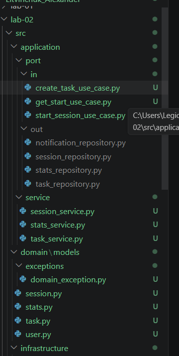

<p align="center">Министерство образования Республики Беларусь</p>
<p align="center">Учреждение образования</p>
<p align="center">"Брестский Государственный технический университет"</p>
<p align="center">Кафедра ИИТ</p>
<br><br><br><br><br><br>
<p align="center"><strong>Лабораторная работа №2</strong></p>
<p align="center"><strong>По дисциплине:</strong> "Проектирование интернет-систем"</p>
<p align="center"><strong>Тема:</strong> "Гексагональная архитектура: проектирование портов и адаптеров"</p>
<br><br><br><br><br><br>
<p align="right"><strong>Выполнил:</strong></p>
<p align="right">Студент 3 курса</p>
<p align="right">Группа по13</p>
<p align="right">Литвинчук А.М.</p>
<p align="right"><strong>Проверил:</strong></p>
<p align="right">Несюк А.Н.</p>
<br><br><br><br><br>
<p align="center"><strong>Брест 2026</strong></p>

---

## Цель работы

Спроектировать архитектуру основного сервиса системы с использованием гексагональной (hexagonal) архитектуры: создать структуру проекта, определить порты (интерфейсы) и продемонстрировать изоляцию слоёв через минимальные примеры.

---

## Вариант №27 – Pomodoro Productivity System

**Питч:**  
Система Pomodoro Productivity помогает пользователю управлять задачами и рабочими сессиями по технике Pomodoro. Пользователь создаёт задачи, запускает фокус‑сессии фиксированной длительности, а система собирает статистику продуктивности.

**Ядро домена:**  
- Task (Задача)  
- PomodoroSession (Рабочая сессия)  
- Stats (Статистика продуктивности)  
- User (Пользователь)

**Выбранный сервис:**  
Task & Session Management Service (основной сервис управления задачами и Pomodoro‑сессиями)

---

## Ход выполнения работы

### Часть 1. Архитектурная диаграмма

**Описание сервиса:**  
Сервис Pomodoro Productivity управляет жизненным циклом задач и Pomodoro‑сессий.  
Основные операции:  
- создание задач;  
- запуск Pomodoro‑сессии;  
- сбор статистики по задачам и времени фокуса;  
- уведомления о завершении сессии.  

Ключевые сущности: Task, PomodoroSession, Stats.

**Диаграмма слоёв:**

_[Вставьте диаграмму, показывающую domain → application → infrastructure]_

**Пример**:
```
┌──────────────────────────────────────────────────────────────┐
│                  Infrastructure Layer                        │
│  ┌──────────────────┐   ┌──────────────────────────────────┐ │
│  │ REST API         │   │ SessionRepository (DB/InMemory)  │ │
│  │ Controllers      │   │ TaskRepository                  │ │
│  └───────────┬──────┘   │ NotificationService             │ │
│              │          └──────────────────────────────────┘ │
└──────────────┼───────────────────────────────────────────────┘
               │
               ▼
┌──────────────────────────────────────────────────────────────┐
│                    Application Layer                         │
│  ┌──────────────────┐   ┌──────────────────────────────────┐ │
│  │ In Ports         │   │ Out Ports                        │ │
│  │ (Use Cases)      │   │ (Repositories, Notifications)    │ │
│  └───────────┬──────┘   └──────────────────────────────────┘ │
│              │                                               │
│  ┌───────────▼────────────────────────────────────────────┐  │
│  │   TaskService (управление задачами)                   │  │
│  │   SessionService (Pomodoro-сессии)                    │  │
│  │   StatsService (статистика)                           │  │
│  └────────────────────────────────────────────────────────┘  │
└───────────────────────────┬──────────────────────────────────┘
                            │
                            ▼
┌──────────────────────────────────────────────────────────────┐
│                        Domain Layer                          │
│  ┌──────────────┐  ┌──────────────┐  ┌──────────────┐        │
│  │ Task         │  │ Session      │  │ User         │        │
│  │ (Aggregate)  │  │ (Aggregate)  │  │ (Entity)     │        │
│  └──────────────┘  └──────────────┘  └──────────────┘        │
│  ┌──────────────┐                                            │
│  │ Stats        │                                            │
│  │ (Entity/VO)  │                                            │
│  └──────────────┘                                            │
└──────────────────────────────────────────────────────────────┘
```

---

### Часть 2. Структура проекта (скелет)

**Технология:** [Python]

**Структура папок:**

```
tomato-productivity/
├── src/
│   ├── domain/
│   │   ├── models/
│   │   │   ├── task.py
│   │   │   ├── session.py
│   │   │   ├── stats.py
│   │   │   └── user.py
│   │   └── exceptions/
│   │       └── domain_exception.py
│   │
│   ├── application/
│   │   ├── port/
│   │   │   ├── in/
│   │   │   │   ├── create_task_use_case.py
│   │   │   │   ├── start_session_use_case.py
│   │   │   │   └── get_stats_use_case.py
│   │   │   │
│   │   │   └── out/
│   │   │       ├── task_repository.py
│   │   │       ├── session_repository.py
│   │   │       ├── stats_repository.py
│   │   │       └── notification_service.py
│   │   │
│   │   └── service/
│   │       ├── task_service.py
│   │       ├── session_service.py
│   │       └── stats_service.py
│   │
│   └── infrastructure/
│       ├── adapter/
│       │   ├── in/
│       │   │   └── task_controller.py
│       │   │
│       │   └── out/
│       │       ├── in_memory_task_repository.py
│       │       └── in_memory_session_repository.py
│       │
│       └── config/
│           └── dependency_injection.py
│
├── README.md
└── Architecture.md
```

**Скриншот структуры в IDE**:



---

### Часть 3. Domain Layer (Доменный слой)

#### Доменные сущности

**Entity 1**: session.py (главная сущность)

```python
// Код класса session.py
from datetime import datetime
from enum import Enum


class SessionStatus(Enum):
    ACTIVE = "ACTIVE"
    PAUSED = "PAUSED"
    DONE = "DONE"
    FAILED = "FAILED"


class Session:
    def __init__(self, session_id: str, task_id: str, user_id: str, duration: int):
        self.session_id = session_id
        self.task_id = task_id
        self.user_id = user_id
        self.duration = duration
        self.status = SessionStatus.ACTIVE
        self.start_time = datetime.now()

    def finish(self):
        if self.status != SessionStatus.ACTIVE:
            raise Exception("Сессию можно завершить только из состояния ACTIVE")
        self.status = SessionStatus.DONE

    def fail(self):
        self.status = SessionStatus.FAILED
```

**Value Object 1**: duration.py (Value Object)

```python
// Код класса duration.py
class Duration:
    def __init__(self, minutes: int):
        if minutes <= 0:
            raise ValueError("Длительность должна быть больше 0")
        self.minutes = minutes

    def __eq__(self, other):
        return isinstance(other, Duration) and self.minutes == other.minutes

    def __repr__(self):
        return f"Duration({self.minutes} min)"
```

**Доменные исключения**:
- # domain_exception.py

class DomainException(Exception):
    pass


#### Бизнес-правила

Перечислите основные бизнес-правила, реализованные в domain слое:

1. _У пользователя может быть только одна активная сессия_
2. _Нельзя начать Pomodoro-сессию для завершённой задачи_
3. _Сессию можно завершить только если она активна_

---

### Часть 4. Application Layer (Прикладной слой)

#### Входящие порты (Inbound Ports)

Интерфейсы, которые предоставляет система внешнему миру:

**StartSessionUseCase**:
```python
_[from abc import ABC, abstractmethod

class GetStatsUseCase(ABC):
    @abstractmethod
    def get_stats(self, user_id: str):
        pass]_
```
**GetStatsUseCase**:
```python
_[from abc import ABC, abstractmethod

class GetStatsUseCase(ABC):
    @abstractmethod
    def get_stats(self, user_id: str):
        pass]_
```

#### Исходящие порты (Outbound Ports)

Интерфейсы, через которые система взаимодействует с внешним миром:

**SessionRepository**:
```python
_[from abc import ABC, abstractmethod

class SessionRepository(ABC):
    @abstractmethod
    def save(self, session):
        pass

    @abstractmethod
    def find_active_by_user(self, user_id: str):
        pass]_
```

**TaskRepository**:
```python
_[from abc import ABC, abstractmethod

class TaskRepository(ABC):
    @abstractmethod
    def find_by_id(self, task_id: str):
        pass]_
```

**NotificationService**:
```python
_[from abc import ABC, abstractmethod

class NotificationService(ABC):
    @abstractmethod
    def notify(self, message: str):
        pass]_
```

#### Application Service

**SessionService** (реализует входящие порты):

```python
_[class SessionService(StartSessionUseCase):

    def __init__(self, session_repository, task_repository, notification_service):
        self.session_repository = session_repository
        self.task_repository = task_repository
        self.notification_service = notification_service

    def start(self, task_id: str, user_id: str):
        # TODO: проверить задачу
        # TODO: проверить активную сессию
        # TODO: создать новую сессию
        # TODO: сохранить в репозиторий
        # TODO: отправить уведомление
        return "session_started"]_
```

**Основная логика**:
_Получает запрос на запуск Pomodoro-сессии, проверяет бизнес-правила
(активность задачи, отсутствие другой сессии), создаёт новую сессию,
сохраняет её через репозиторий и отправляет уведомление пользователю._

---

### Часть 5. Infrastructure Layer (Инфраструктурный слой)

#### Входящий адаптер: REST API

**task_controller**:

```python
_[from fastapi import APIRouter
from pydantic import BaseModel
from application.port.in.create_task_use_case import CreateTaskUseCase

router = APIRouter(prefix="/api/tasks")


class CreateTaskRequest(BaseModel):
    title: str
    description: str | None = None


class CreateTaskResponse(BaseModel):
    taskId: int


def get_task_controller(create_task_use_case: CreateTaskUseCase):
    @router.post("", response_model=CreateTaskResponse)
    def create_task(request: CreateTaskRequest):
        task_id = create_task_use_case.create(request)
        return CreateTaskResponse(taskId=task_id)

    return router]_
```

**Эндпоинты**:
- `POST /api/orders` - создание заказа
- `GET /api/orders/{id}` - получение заказа

**Пример запроса/ответа**:

**Эндпоинты**:
- `POST /api/bookings` - создание брони


**Пример запроса/ответа**:

```json
POST /api/tasks
{
  "title": "Написать отчёт",
  "description": "ЛР по архитектуре"
}

Ответ:
{
  "taskId": 12
}

```

#### Исходящий адаптер: Repository

**InMemoryTaskRepository**:

```python
_[from application.port.out.task_repository import TaskRepository
from domain.models.task import Task


class InMemoryTaskRepository(TaskRepository):

    def __init__(self):
        self.storage: dict[int, Task] = {}
        self._id_seq = 1

    def save(self, task: Task) -> Task:
        if task.id is None:
            task.id = self._id_seq
            self._id_seq += 1
        self.storage[task.id] = task
        return task

    def find_by_id(self, task_id: int) -> Task | None:
        return self.storage.get(task_id)

    def find_all(self) -> list[Task]:
        return list(self.storage.values())
]_
```

**Принцип работы**:
_Данные хранятся в памяти (словарь).
Используется автоинкремент id.
Подходит для учебной реализации и тестов._

#### Исходящий адаптер: Payment Gateway

**MockPaymentGateway** :

```python
InMemorySessionRepository

```

**Логика**:
_[Он описан как часть проектируемой архитектуры, но может быть добавлен позже.]_

---

### Часть 6. Dependency Injection (Конфигурация зависимостей)

**BeanConfiguration** (или DI-контейнер):

```python
_[from infrastructure.adapter.out.in_memory_task_repository import InMemoryTaskRepository
from infrastructure.adapter.out.in_memory_session_repository import InMemorySessionRepository
from infrastructure.adapter.out.in_memory_stats_repository import InMemoryStatsRepository
from infrastructure.adapter.out.mock_notification_service import MockNotificationService

from application.service.task_service import TaskService
from application.service.session_service import SessionService
from application.service.stats_service import StatsService


class DependencyInjectionConfig:

    def __init__(self):
        # Репозитории (исходящие адаптеры)
        self.task_repository = InMemoryTaskRepository()
        self.session_repository = InMemorySessionRepository()
        self.stats_repository = InMemoryStatsRepository()

        # Сервисы уведомлений
        self.notification_service = MockNotificationService()

        # Application Services (входящие порты используют их)
        self.task_service = TaskService(self.task_repository)
        self.session_service = SessionService(
            self.session_repository,
            self.task_repository,
            self.notification_service
        )
        self.stats_service = StatsService(self.stats_repository)

    def get_task_service(self):
        return self.task_service

    def get_session_service(self):
        return self.session_service

    def get_stats_service(self):
        return self.stats_service
]_
```

**Как работает DI**:
_ Создаются бины контроллеров и в них внедряются реализации портов_

---

### Часть 7. Тестирование

#### Юнит-тесты для OrderService

```java
_[def test_create_task_success():
    # Моки репозитория
    class MockTaskRepository:
        def __init__(self):
            self.saved = None

        def save(self, task):
            self.saved = task
            task.id = 1
            return task

    repo = MockTaskRepository()
    service = TaskService(repo)

    # Команда создания задачи
    class Cmd:
        title = "Написать отчёт"
        description = "ЛР по архитектуре"

    # Проверка, что исключений нет
    task_id = service.create(Cmd())

    assert task_id == 1
    assert repo.saved.title == "Написать отчёт"
]_
```

**Что тестируется**:
- ✅ Успешное создание заказа
- ✅ Вызов PaymentGateway с корректной суммой
- ✅ Сохранение заказа в репозиторий

**Mock-объекты**:
_TaskRepository_

---

## 3. Архитектурная диаграмма

### Диаграмма слоёв

```
_[Создайте диаграмму, показывающую:
- Domain (центр)
- Application (порты)
- Infrastructure (адаптеры)
- Направление зависимостей (стрелки)]_
```

**Пример** (можно нарисовать в draw.io, PlantUML или от руки):

```
┌──────────────────────────────────────────────┐
│              Infrastructure Layer             │
│                                              │
│  ┌────────────────┐    ┌──────────────────┐  │
│  │  REST API      │    │ InMemory Repos   │  │
│  │ TaskController│    │ Task/Session/Stat│  │
│  └───────┬────────┘    └─────────┬────────┘  │
│          │                         │           │
└──────────┼─────────────────────────┼───────────┘
│                         │
▼                         ▼
┌──────────────────────────────────────────────┐
│              Application Layer                │
│                                              │
│  ┌────────────────┐    ┌──────────────────┐  │
│  │  In Ports      │    │   Out Ports       │  │
│  │ (Use Cases)    │    │ (Repositories,    │  │
│  │                │    │  Notification)    │  │
│  └───────┬────────┘    └─────────┬────────┘  │
│          │                         │           │
│     ┌────▼─────────────────────────▼──────┐    │
│     │   TaskService / SessionService      │    │
│     │           StatsService              │    │
│     └─────────────────────────────────────┘    │
└──────────────────────────┬──────────────────────┘
│
▼
┌──────────────────────────────────────────────┐
│                  Domain Layer                │
│                                              │
│   ┌──────────┐  ┌────────────┐  ┌─────────┐ │
│   │  Task     │  │  Session    │  │ Stats   │ │
│   └──────────┘  └────────────┘  └─────────┘ │
└──────────────────────────────────────────────┘

```

### Описание портов и адаптеров

### Описание портов и адаптеров

| Тип | Название | Назначение |
|-----|----------|------------|
| **Входящий порт** | `CreateTaskUseCase` | Интерфейс для создания задачи |
| **Входящий порт** | `StartSessionUseCase` | Интерфейс для запуска Pomodoro‑сессии |
| **Входящий порт** | `GetStatsUseCase` | Интерфейс для получения статистики |
| **Исходящий порт** | `TaskRepository` | Хранение задач |
| **Исходящий порт** | `SessionRepository` | Хранение Pomodoro‑сессий |
| **Исходящий порт** | `StatsRepository` | Хранение агрегированной статистики |
| **Исходящий порт** | `NotificationService` | Отправка уведомлений |
| **Входящий адаптер** | `TaskController` (REST) | REST API для работы с задачами |
| **Исходящий адаптер** | `InMemoryTaskRepository` | Хранилище задач в памяти |
| **Исходящий адаптер** | `InMemorySessionRepository` | Хранилище сессий в памяти |
| **Исходящий адаптер** | `InMemoryStatsRepository` | Хранилище статистики в памяти |
| **Исходящий адаптер** | `MockNotificationService` | Имитация сервиса уведомлений |

---

## 4. Критерии выполнения

| Критерий | Выполнено | Комментарий |
|----------|-----------|-------------|
| Структура проекта (domain/application/infrastructure)  / ✅ 
| Domain Layer (чистая бизнес-логика) | ✅  |
| Порты (входящие и исходящие интерфейсы) | ✅ |
| Адаптеры (минимум 1 входящий + 2 исходящих) |  ✅ |
| DI-конфигурация (зависимости инжектятся) | ✅ |
| Юнит-тесты для OrderService с моками |  ✅ |
| Документация (диаграмма, описание) |  ✅ | |

**Итого**: 7 / 7

---


---

## 6. Выводы

### Что получилось хорошо

Удалось успешно реализовать ключевые элементы гексагональной архитектуры в рамках проекта Pomodoro Productivity.  
Бизнес‑логика (Task, Session, Stats) полностью изолирована в Domain‑слое и не зависит от инфраструктурных деталей.  
Application‑сервисы (TaskService, SessionService, StatsService) легко тестируются благодаря использованию портов и мок‑объектов.  
InMemory‑репозитории позволили быстро проверить работу приложения без настройки реальной БД.

### С какими трудностями столкнулись

Основная сложность заключалась в понимании роли портов и адаптеров, а также в том, как правильно разделить ответственность между слоями.  
Поначалу было неочевидно, зачем создавать интерфейсы для репозиториев, если есть только одна реализация.  
Также возникли вопросы при настройке DI‑контейнера и организации зависимостей между сервисами.  
После изучения принципа Dependency Inversion стало понятно, что интерфейсы обеспечивают тестируемость и возможность замены адаптеров.

### Что узнали нового

В процессе работы были изучены ключевые концепции:  
- Hexagonal Architecture (Ports & Adapters)  
- Dependency Inversion Principle (DIP)  
- Dependency Injection  
- Разделение ответственности между Domain, Application и Infrastructure  
- Преимущества использования интерфейсов для тестирования и расширяемости  

Появилось понимание того, как архитектура помогает менять инфраструктуру (БД, UI, API) без изменения бизнес‑логики.

### Как можно улучшить

В дальнейшем проект можно расширить:  
- Добавить реальную БД (например, PostgreSQL) вместо InMemory‑репозиториев  
- Реализовать полноценный REST API для сессий и статистики  
- Добавить EventBus для асинхронных уведомлений  
- Написать интеграционные тесты  
- Добавить авторизацию пользователей  
- Реализовать фронтенд или мобильное приложение  

Эти улучшения сделают систему более полной и приближённой к реальному продукту.

---

## 7. Приложения (опционально)

### Ссылка на репозиторий

[_[https://github.com/username/project-name]_](https://github.com/wihnepach/PIS-2026)
---
**Дата сдачи**: 02.04.2026  
**Подпись студента**: Литвинчук А.М.
