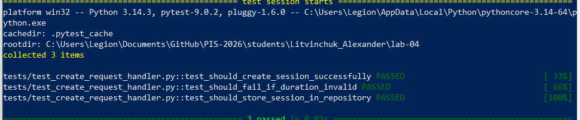
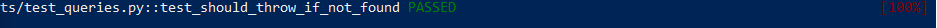
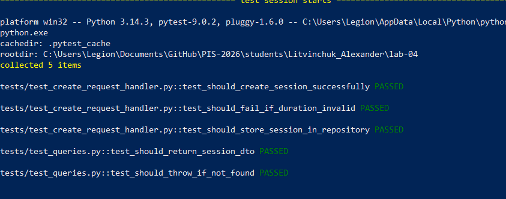

<p align="center">Министерство образования Республики Беларусь</p>
<p align="center">Учреждение образования</p>
<p align="center">"Брестский Государственный технический университет"</p>
<p align="center">Кафедра ИИТ</p>
<br><br><br><br><br><br>
<p align="center"><strong>Лабораторная работа №4</strong></p>
<p align="center"><strong>По дисциплине:</strong> "Проектирование интернет-систем"</p>
<p align="center"><strong>Тема:</strong> "Application Layer: Commands, Queries, Handlers"</p>
<br><br><br><br><br><br>
<p align="right"><strong>Выполнил:</strong></p>
<p align="right">Студент 3 курса</p>
<p align="right">Группа по-13</p>
<p align="right">Литвинчук А.М.</p>
<p align="right"><strong>Проверил:</strong></p>
<p align="right">Несюк А.Н.</p>
<br><br><br><br><br>
<p align="center"><strong>Брест 2026</strong></p>

---

## Цель работы

Реализовать **прикладной слой** (Application Layer) с разделением операций на **команды** (изменяют состояние) и **запросы** (читают данные) по паттерну CQRS.

---

## Вариант №27 - Система управления Pomodoro-сессиями

**Питч:**  
Система предназначена для управления Pomodoro-сессиями пользователя: создание сессии, отслеживание её состояния (активна, завершена, ошибка), а также фиксация событий выполнения задач.

**Ядро домена:**  
- Session (сессия)  
- Duration (длительность)  
- SessionStatus (статус сессии)  
- Domain Events (SessionStarted, SessionCompleted, SessionFailed)
---

## Ход выполнения работы

### 1. Команды (Commands)

**Созданные команды:**

1. **CreateRequestCommand** - команда создания Pomodoro-сессии  
   - Поля: `session_id, task_id, user_id, duration_minutes`  
   - Валидация:
     - `session_id`, `task_id`, `user_id` не должны быть пустыми  
     - `duration_minutes` должен быть больше 0  
   - Файл: `lab-04/application/command/create_request_command.py`

2. **AssignGroupCommand** - команда изменения состояния сессии (завершение или ошибка)  
   - Поля: `session_id, action, reason`  
   - Валидация:
     - `session_id` обязателен  
     - `action` может быть только `"finish"` или `"fail"`  
   - Файл: `lab-04/application/command/assign_group_command.py`

---

**Пример кода команды:**

```python
from dataclasses import dataclass


@dataclass(frozen=True)
class CreateRequestCommand:
    session_id: str
    task_id: str
    user_id: str
    duration_minutes: int

    def __post_init__(self):
        if not self.session_id:
            raise ValueError("session_id обязателен")
        if not self.task_id:
            raise ValueError("task_id обязателен")
        if not self.user_id:
            raise ValueError("user_id обязателен")
        if self.duration_minutes <= 0:
            raise ValueError("duration_minutes должен быть > 0")
```  
---

### 2. Command Handlers

**Созданные обработчики:**

1. **CreateRequestHandler** - создаёт новую Pomodoro-сессию  
   - Шаги обработки:
     - Валидация команды (в `CreateRequestCommand`)
     - Создание Value Object `Duration`
     - Создание агрегата `Session`
     - Сохранение через repository
   - Возвращает: `session_id`
   - Файл: `lab-04/application/command/handlers/create_request_handler.py`

2. **AssignGroupHandler** - изменяет состояние сессии (завершение или ошибка)  
   - Шаги:
     - Загрузка сессии из repository
     - Выполнение действия (`finish()` или `fail()`)
     - Сохранение обновлённой сессии
   - Возвращает: `void`
   - Файл: `lab-04/application/command/handlers/assign_group_handler.py`

---

**Пример кода handler:**

```python
from application.command.assign_group_command import AssignGroupCommand


class AssignGroupHandler:

    def __init__(self, session_repository):
        self.session_repository = session_repository

    def handle(self, command: AssignGroupCommand):
        # 1. загрузка агрегата
        session = self.session_repository.find_by_id(command.session_id)

        if not session:
            raise ValueError("Session не найдена")

        # 2. изменение состояния
        if command.action == "finish":
            session.finish()
        elif command.action == "fail":
            session.fail(command.reason or "error")

        # 3. сохранение
        self.session_repository.save(session)
```

**Скриншот теста:**


---

### 3. Queries (Запросы)

**Созданные запросы:**

1. **GetSessionByIdQuery** - получение сессии по ID  
   - Поля: `session_id`  
   - Файл: `lab-04/application/query/get_session_by_id_query.py`

2. **ListSessionsQuery** - получение списка сессий  
   - Поля: `user_id (опционально)`  
   - Файл: `lab-04/application/query/list_sessions_query.py`

---

**Read DTOs:**

- **SessionDto** - упрощённая модель для чтения  
   - Поля: `session_id, task_id, user_id, status, duration_minutes`  
   - Файл: `lab-04/application/query/dto/session_dto.py`

---

**Пример кода:**

```python
# Query
from dataclasses import dataclass


@dataclass(frozen=True)
class GetSessionByIdQuery:
    session_id: str

    def __post_init__(self):
        if not self.session_id:
            raise ValueError("session_id обязателен")
```

# DTO
from dataclasses import dataclass


@dataclass(frozen=True)
class SessionDto:
    session_id: str
    task_id: str
    user_id: str
    status: str
    duration_minutes: int

---

### 4. Query Handlers

**Созданные обработчики запросов:**

1. **GetSessionByIdHandler** - получает сессию по ID  
   - Репозиторий: `session_repository`  
   - Возвращает: `SessionDto`  
   - Файл: `lab-04/application/query/handlers/get_session_by_id_handler.py`

---

**Пример кода:**

```python
from application.query.get_session_by_id_query import GetSessionByIdQuery
from application.query.dto.session_dto import SessionDto


class GetSessionByIdHandler:

    def __init__(self, session_repository):
        self.session_repository = session_repository

    def handle(self, query: GetSessionByIdQuery) -> SessionDto:
        # 1. получаем из репозитория
        session = self.session_repository.find_by_id(query.session_id)

        if not session:
            raise ValueError("Session не найдена")

        # 2. преобразуем в DTO
        return SessionDto(
            session_id=session.session_id,
            task_id=session.task_id,
            user_id=session.user_id,
            status=session.status.value,
            duration_minutes=session.duration.minutes
        )
```

**Скриншот:**



---

### 5. Application Service (Фасад)

**Реализованный сервис:** `SessionService`

**Методы:**

| Метод | Тип | Возвращает |
|-------|-----|------------|
| `create_session(command)` | Command | ID |
| `change_session_state(command)` | Command | void |
| `get_session_by_id(query)` | Query | SessionDto |

---

**Пример кода:**

```python
from application.command.handlers.create_request_handler import CreateRequestHandler
from application.command.handlers.assign_group_handler import AssignGroupHandler
from application.query.handlers.get_session_by_id_handler import GetSessionByIdHandler


class SessionService:
    """
    Фасад для работы с сессиями
    """

    def __init__(self, repository):
        self.create_handler = CreateRequestHandler(repository)
        self.assign_handler = AssignGroupHandler(repository)
        self.query_handler = GetSessionByIdHandler(repository)

    def create_session(self, command):
        return self.create_handler.handle(command)

    def change_session_state(self, command):
        return self.assign_handler.handle(command)

    def get_session_by_id(self, query):
        return self.query_handler.handle(query)
```
---

### 6. Тестирование

## 6. Тестирование

### 6.1. Юнит‑тесты уровня Application (Handlers)

| № | Тест | Проверяемое поведение | Ожидаемый результат | Статус |
|---|------|------------------------|----------------------|--------|
| 1 | `test_should_create_session_successfully` | Корректное создание новой сессии через CreateRequestHandler | Возвращается валидная Session, сохраняемая в репозитории | ✅ |
| 2 | `test_should_fail_if_duration_invalid` | Проверка валидации продолжительности | Должно быть выброшено исключение при некорректной длительности | ✅ |
| 3 | `test_should_store_session_in_repository` | Проверка сохранения сессии в репозитории | Сессия появляется в FakeSessionRepository | ✅ |
| 4 | `test_should_return_session_dto` | Корректная работа GetSessionByIdHandler | Возвращается корректный SessionDto | ✅ |
| 5 | `test_should_throw_if_not_found` | Обработка отсутствующей сессии | Должно быть выброшено ValueError | ✅ |

### 6.2. Результаты выполнения тестов
**Скриншот теста:**



---

## Таблица критериев оценки

| Критерий | Баллы | Выполнено |
|----------|-------|-----------|
| Команды (DTOs): иммутабельность, валидация примитивов | 15 | ✅ |
| Command Handlers: транзакции, события, сохранение | 25 | ✅ |
| Запросы (DTOs): read-модели без побочных эффектов | 10 |  ✅ |
| Query Handlers: преобразование домена в DTO | 15 |  ✅ |
| Application Service (фасад): делегирование | 20 |  ✅ |
| Юнит-тесты handlers: mocker, события | 10 |  ✅ |
| Качество документации | 5 |  ✅ |
| **ИТОГО** | **100** | |

---


---

## Контрольные вопросы

1. **В чём разница между Command и Query?**
   - Command изменяет состояние системы (создаёт, обновляет, удаляет данные).  
     Query только читает данные и не изменяет состояние.

2. **Почему Command Handler возвращает только ID, а не весь объект?**
   - Чтобы не смешивать запись и чтение (CQRS).  
     После создания объект можно получить через Query, а Command остаётся лёгким и независимым.

3. **Где должна выполняться валидация: в команде, обработчике или доменной модели?**
   - В команде — базовая валидация примитивов (пустые значения, формат).  
   - В доменной модели — бизнес-правила и инварианты.  
   - В обработчике — дополнительная проверка и координация.

4. **Можно ли вызывать Query из Command Handler?**
   - Обычно нет, чтобы не нарушать разделение CQRS.  
     Command Handler должен работать только с изменением состояния через доменную модель и репозиторий.

5. **Зачем разделять Request DTO (от клиента) и Command (внутренний)?**
   - Чтобы изолировать внешний слой от доменной логики.  
     DTO может меняться (например, API), а Command остаётся стабильным и используется внутри приложения.
---

## Ссылка на репозиторий

👉 **GitHub:** https://github.com/username/project-name (https://github.com/wihnepach/PIS-2026)

**Структура папки:**
```                                                                                     >> cd PS C:\Users\Legion> mkdir lab-04
>> cd lab-04
>>
>> mkdir application
>> mkdir application\command
>> mkdir application\command\handlers
>> mkdir application\query
>> mkdir application\query\handlers
>> mkdir application\service
>> mkdir tests
>>
>> ni Отчет.md
>> ni application\command\create_request_command.py
>> ni application\command\assign_group_command.py
>> ni application\command\handlers\create_request_handler.py
>> ni application\command\handlers\assign_group_handler.py
>> ni application\query\get_request_by_id_query.py
>> ni application\query\handlers\get_request_by_id_handler.py
>> ni application\service\request_service.py
>> ni tests\test_create_request_handler.py
>> ni tests\test_queries.py
```

---

## Вывод

В ходе работы реализована архитектура с разделением на команды (Command) и запросы (Query) по принципу CQRS.  
Созданы команды и обработчики для управления сессией (создание, завершение, ошибка), а также запросы для получения данных.

Реализован Aggregate Root `Session`, который инкапсулирует бизнес-логику и генерирует доменные события (`SessionStarted`, `SessionCompleted`, `SessionFailed`).  
Команды являются иммутабельными и выполняют базовую валидацию, а бизнес-правила проверяются внутри доменной модели.

Application Service (фасад) делегирует выполнение логики соответствующим handler'ам.  
Все ключевые сценарии покрыты юнит-тестами, включая проверку инвариантов и генерацию доменных событий.

В ходе работы были решены проблемы с импортами модулей и структурой проекта, а также настроено корректное взаимодействие между слоями приложения.
---

**Дата выполнения:** 06.04.2026

