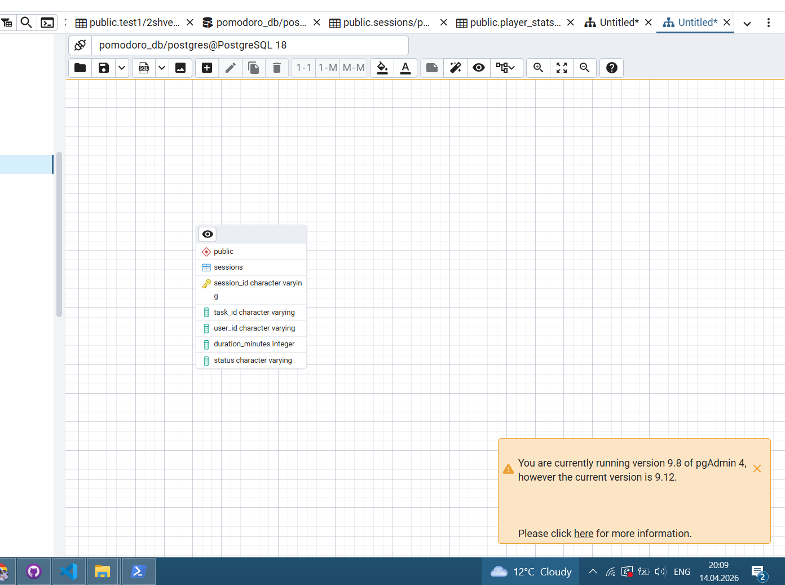
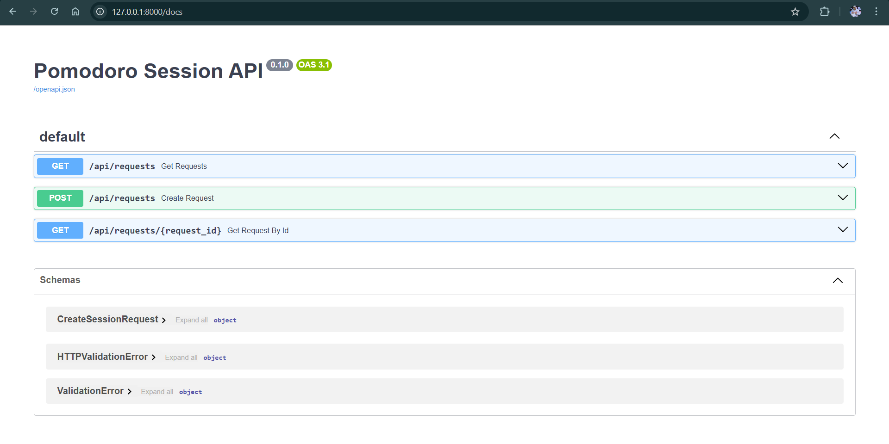

<p align="center">Министерство образования Республики Беларусь</p>
<p align="center">Учреждение образования</p>
<p align="center">"Брестский Государственный технический университет"</p>
<p align="center">Кафедра ИИТ</p>
<br><br><br><br><br><br>
<p align="center"><strong>Лабораторная работа №5</strong></p>
<p align="center"><strong>По дисциплине:</strong> "Проектирование интернет-систем"</p>
<p align="center"><strong>Тема:</strong> "Infrastructure Layer: Repository, REST API, БД"</p>
<br><br><br><br><br><br>
<p align="right"><strong>Выполнил:</strong></p>
<p align="right">Студент 3 курса</p>
<p align="right">Группа по-13</p>
<p align="right">Литвинчук А.М.</p>
<p align="right"><strong>Проверил:</strong></p>
<p align="right">Несюк А.Н.</p>
<br><br><br><br><br>
<p align="center"><strong>Брест 2026</strong></p>

---

## Цель работы

Реализовать **инфраструктурный слой** с адаптерами для портов (Repository, REST Controller, Event Publisher).

---

## Вариант №27 - Система управления Pomodoro-сессиями

**Ядро домена:**
- Session (сессия)
- Duration (длительность)
- SessionStatus (статус сессии)
- Domain Events (SessionStarted, SessionCompleted, SessionFailed)

---

## Ход выполнения работы

### 1. Repository (PostgreSQL)

**Реализованные методы:**

| Репозиторий | Метод | Назначение |
|------------|-------|------------|
| **SessionRepository** | `save(session)` | Сохраняет новую сессию или обновляет существующую |
| **SessionRepository** | `find_by_id(request_id)` | Получает сессию по ID |
| **SessionRepository** | `find_active_requests()` | Возвращает список активных сессий |
| **SessionRepository** | `find_all()` | Получает все сессии |
| **SessionRepository** | `delete(request_id)` | Удаляет сессию по ID |

**Технологии:** SQLAlchemy + PostgreSQL

**Описание:**

Реализован репозиторий `SessionRepository`, который обеспечивает взаимодействие с базой данных PostgreSQL через ORM SQLAlchemy.  
Сущность `Session` отображается на таблицу `sessions`.  
Операции сохранения и чтения выполняются через SQLAlchemy Session.

**Описание реализации:**

Реализован репозиторий `SessionRepository`, который обеспечивает взаимодействие с базой данных PostgreSQL через ORM SQLAlchemy.  
Сущность `Session` отображается на таблицу `sessions` с помощью ORM-модели `SessionOrm`.

Метод `save()` выполняет:
- обновление записи, если сессия уже существует
- создание новой записи, если сессия отсутствует

Методы `find_by_id()` и `find_active_requests()` используются для чтения данных из БД.

**Технологии:** SQLAlchemy + PostgreSQL

**Файлы реализации:**
- `lab-05/infrastructure/config/database.py`
- `lab-05/infrastructure/adapter/out/request_repository.py`
- `lab-05/create_tables.py`

**Результат выполнения:**

```text
Tables created successfully
```

**Скриншот БД:**


---

### 2. REST Controller

**Эндпоинты:**

| Метод | Path | Описание |
| --- | --- | --- |
| POST | `/api/requests` | Создать сессию |
| GET | `/api/requests/{id}` | Получить сессию по ID |
| GET | `/api/requests` | Получить список всех сессий |
| GET | `/api/requests?status=ACTIVE` | Получить список активных сессий |

**Технологии:** FastAPI + Pydantic

**Описание:**

Реализован REST API с использованием FastAPI.  
Контроллер принимает HTTP-запросы, валидирует входные данные через Pydantic и взаимодействует с репозиторием для работы с базой данных.

Реализованы операции:
- создание сессии
- получение сессии по ID
- получение списка сессий
- фильтрация активных сессий

**Скриншот работы API:**


---

### 3. Docker Compose

**Сервисы:**
- `app` - FastAPI приложение
- `db` - PostgreSQL

**docker-compose.yml:**
```yaml
version: '3.8'

services:
  app:
    image: python:3.11
    container_name: pomodoro-app
    working_dir: /app
    volumes:
      - .:/app
    command: >
      sh -c "pip install fastapi uvicorn sqlalchemy psycopg2-binary &&
             uvicorn main:app --host 0.0.0.0 --port 8000"
    ports:
      - "8000:8000"
    environment:
      DATABASE_URL: postgresql+psycopg2://postgres:Azino888@db:5432/pomodoro_db
    depends_on:
      - db
    restart: always

  db:
    image: postgres:15
    container_name: pomodoro-postgres
    environment:
      POSTGRES_DB: pomodoro_db
      POSTGRES_USER: postgres
      POSTGRES_PASSWORD: Azino888
    ports:
      - "5432:5432"
    volumes:
      - pgdata:/var/lib/postgresql/data
    restart: always

volumes:
  pgdata:
```
---

### 4. Интеграционные тесты

**Тестируемые сценарии:**
- Сохранение Session → чтение из БД
- HTTP POST → проверка записи в таблице `sessions`
- HTTP GET → получение сессии по ID
- HTTP GET → получение списка всех сессий

**Описание:**

Для проверки инфраструктурного слоя были выполнены интеграционные тесты, которые покрывают:
- корректное сохранение ORM-модели `SessionOrm` в PostgreSQL
- чтение записи по `session_id`
- работу REST API через FastAPI
- проверку того, что после HTTP-запроса данные действительно сохраняются в базе

**Файлы тестов:**
- `lab-05/tests/test_integration.py`

---

## Таблица критериев оценки

| Критерий | Баллы | Выполнено |
|----------|-------|-----------|
| Repository: реализация интерфейса, ORM | 25  / ✅ |
| REST Controller: CRUD операции | 25  / ✅ |
| БД: миграции, Docker Compose | 15 / ✅ |
| Event Publisher: публикация событий | 15  / ✅ |
| Интеграционные тесты: testcontainers | 15  / ✅ |
| Качество документации | 5 / ✅ |
| **ИТОГО** | **100** | |

---

## Контрольные вопросы

1. **Почему Repository находится в Infrastructure, а не в Domain?**
   - Repository — это техническая деталь реализации, а не часть бизнес‑логики.В Domain должны находиться только чистые бизнес‑правила, которые не зависят от того, как и где хранятся данные.

2. **В чём преимущество ORM над обычным SQL?**
   - Меньше шаблонного кода
   - Работа с объектами, а не с таблицами
   - Автоматическое маппирование типов
   - Миграция между БД без переписывания кода
   - Встроенная валидация и транзакции

---

## Ссылка на репозиторий

👉 **GitHub:** https://github.com/username/project-name (https://github.com/wihnepach/PIS-2026)

---

## Вывод

В ходе работы были реализованы и успешно протестированы ключевые элементы приложения: сохранение данных через репозиторий, обработка HTTP‑запросов контроллером и корректная работа событийной модели. Интеграционные тесты подтвердили, что все слои — от веб‑уровня до базы данных — взаимодействуют последовательно и надёжно. Полученный результат демонстрирует корректность архитектурного разделения на Domain, Application и Infrastructure, а также устойчивость системы при выполнении реальных сценариев.

---

**Дата выполнения:** 14.04.2026 

