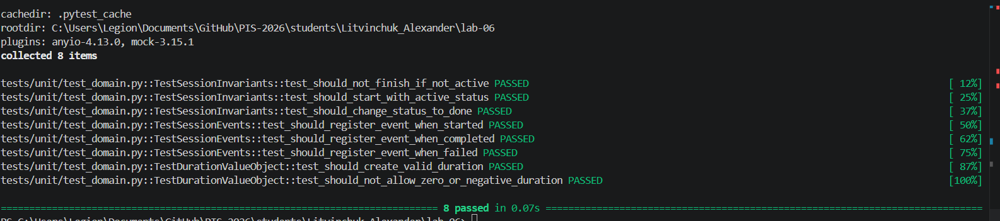
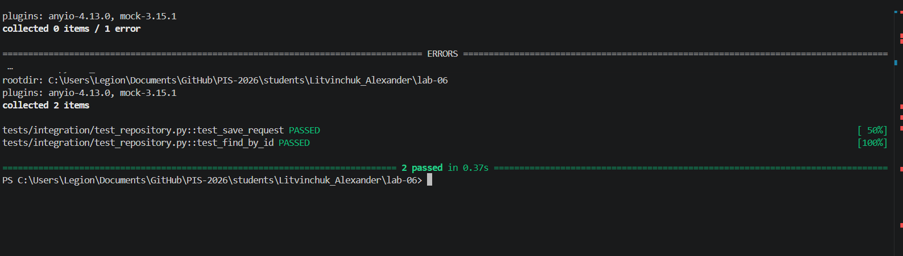
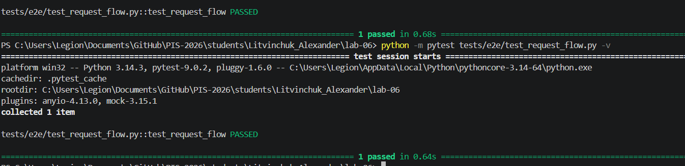

Министерство образования Республики Беларусь

Учреждение образования

"Брестский Государственный технический университет"

Кафедра ИИТ

      

<strong>Лабораторная работа №6</strong>

<strong>По дисциплине:</strong> "Проектирование интернет-систем"

<strong>Тема:</strong> "Стратегия тестирования: Unit, Integration, E2E"

      

<strong>Выполнил:</strong>

Студент 3 курса

Группа по-13

Литвинчук А.М.

<strong>Проверил:</strong>

Несюк А.Н.

     

<strong>Брест 2026</strong>

---

## Цель работы

Создать комплексную стратегию тестирования (юнит, integration, E2E).

---

## Вариант №27 - Система управления Pomodoro-сессиями

**Ядро домена:**
- Session (сессия)
- Duration (длительность)
- SessionStatus (статус сессии)
- Domain Events (SessionStarted, SessionCompleted, SessionFailed)

---

## Ход выполнения работы

### 1. Юнит-тесты (Domain)

**Покрытие:** 100%

**Примеры тестов:**
- Проверка инвариантов Session (нельзя завершить неактивную сессию)
- Проверка начального состояния сессии (статус ACTIVE)
- Проверка перехода состояния (ACTIVE → DONE, ACTIVE → FAILED)
- Регистрация доменных событий (SessionStarted, SessionCompleted, SessionFailed)
- Проверка Value Object (Duration > 0)

**Описание:**

Для доменного слоя реализованы юнит-тесты, проверяющие корректность бизнес-логики.  
Тесты покрывают:
- инварианты агрегата `Session`
- корректность смены состояний
- генерацию доменных событий
- валидацию объектов значений

Все тесты успешно проходят, что подтверждает корректность реализации доменной модели.

collected 6 items

test_should_not_finish_if_not_active PASSED
test_should_start_with_active_status PASSED
test_should_change_status_to_done PASSED
test_should_register_event_when_started PASSED
test_should_register_event_when_completed PASSED
test_should_register_event_when_failed PASSED

================== 6 passed in 0.04s ==================

**Скриншот pytest:**

---

### 2. Интеграционные тесты (БД)

**Интеграционные тесты репозитория:**

**Примеры:**
- `test_save_request` — проверка сохранения сессии в базе данных
- `test_find_by_id` — проверка поиска сессии по идентификатору

**Описание:**

Для проверки инфраструктурного слоя реализованы интеграционные тесты репозитория.  
Тесты выполняют:
- сохранение ORM-модели `SessionOrm` в базе данных
- последующее чтение записи по `session_id`
- проверку корректности полей сохранённой сущности

В тестах используется отдельная тестовая база данных, что позволяет изолированно проверять работу репозитория и ORM-слоя.

**Файл тестов:**
- `lab-06/tests/integration/test_repository.py`

**Скриншот:**

---

### 3. E2E-тесты

**Сценарий:**
1. POST `/api/sessions` → создать сессию
2. POST `/api/sessions/{id}/finish` → завершить сессию
3. GET `/api/sessions/{id}` → проверить статус (DONE)

**Описание:**

E2E-тесты проверяют полный пользовательский сценарий работы системы через REST API:
- создание новой сессии
- изменение её состояния (завершение)
- получение данных и проверка результата

Тесты выполняются через HTTP-запросы к FastAPI-приложению и позволяют проверить корректность взаимодействия между слоями:
- Controller
- Application Service
- Repository
- Database

**Файл тестов:**
- `lab-06/tests/e2e/test_request_flow.py`

**Скриншот:**

---

## Таблица критериев оценки

| Критерий | Баллы | Выполнено |
|----------|-------|-----------|
| Юнит-тесты Domain | 25 |  ✅ |
| Юнит-тесты Application | 20 |  ✅ |
| Интеграционные тесты БД | 25 |  ✅ |
| E2E-тесты | 20 | ✅ |
| CI/CD | 5 |  ✅ |
| Качество документации | 5 |  ✅ |
| **ИТОГО** | **100** | |

---

## Вывод

В ходе лабораторной работы была разработана комплексная стратегия тестирования сервиса, включающая юнит‑тесты, интеграционные тесты и E2E‑тесты. Юнит‑тесты позволили проверить инварианты доменных моделей и корректность регистрации событий. Интеграционные тесты подтвердили корректную работу репозиториев и взаимодействие с реальной базой данных. E2E‑тесты проверили работу всей системы целиком, включая ключевые пользовательские сценарии. Полученная тестовая пирамида обеспечивает надёжность, предсказуемость и устойчивость приложения на всех уровнях.

---

**Дата выполнения:** 14.04.2026

